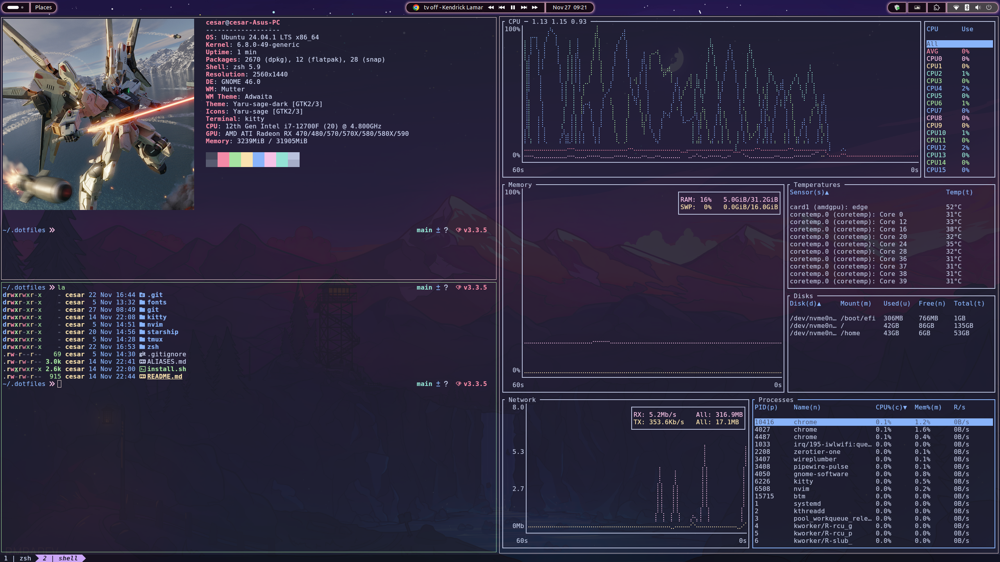
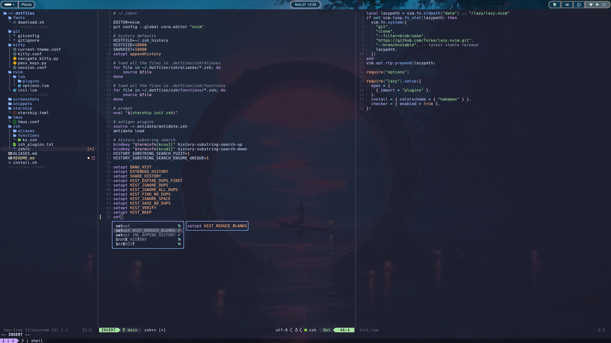
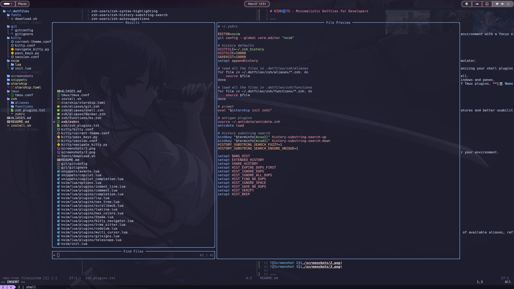

# KIDD🌀TS - Minimalistic Dotfiles for Developers

## 🌟 Overview

KIDD🌀TS is a carefully crafted collection of dotfiles designed to create a productive, efficient, and streamlined development environment. With a focus on simplicity, performance, and usability, this setup empowers developers to work smarter, not harder.

## 🛠 Tools Ecosystem

### Terminal & Shell
- **[🐱 Kitty](https://sw.kovidgoyal.net/kitty/)**: A lightning-fast, GPU-accelerated terminal emulator
- **[⬛ Zsh](https://www.zsh.org/)**: A powerful shell with extensive customization capabilities
- **[💉 Antidote](https://getantidote.github.io/)**: Efficient Zsh plugin management

### Productivity Boosters
- **[🚀 Starship](https://starship.rs/)**: A minimal and blazing-fast cross-shell prompt
- **[🪟 Tmux](https://tmux.github.io/)**: Terminal multiplexer for managing multiple sessions
- **[🔌 TPM](https://github.com/tmux-plugins/tpm)**: Streamlined Tmux plugin management

### Development
- **[📓 Neovim](https://neovim.io/)**: Modern, extensible text editor for power users

## 🔧 System Requirements

### Minimum Dependencies
- Neovim v0.10+
- Kitty Terminal v0.32+
- [Eza](https://github.com/eza-community/eza) Modern `ls` replacement
- zsh
- luarocks
- git
- curl
- unzip
- ripgrep

here is what I use for my system:
https://github.com/cesargomez89/dotflakes/blob/main/nixos/configuration.nix#L116

## 🚀 Quick Start

### Installation
Install KIDD🌀TS with a single command:

```bash
curl -s https://raw.githubusercontent.com/cesargomez89/kiddots/main/install.sh | bash
```

## 🌈 Key Features

### Kitty Navigation Shortcuts

#### Pane & Window Movement
- `Ctrl + h/j/k/l`: Seamless navigation between panes and windows
- `Ctrl + Shift + Left/Right Arrow`: Quick tab switching
- `Ctrl + TAB`: Cycle through tabs
- `Ctrl + Shift + t`: Instantly open new tabs
- `Ctrl + Shift + l`: Toggle layout between standard and zoomed

### Shell Productivity
- Comprehensive set of shell aliases
- Detailed alias documentation available in [ALIASES.md](ALIASES.md)

### Neovim Configuration

#### Core Setup
- **Package Manager**: Lazy.nvim
- **Plugins**: Curated collection in [lua plugins](./nvim/lua/plugins/)
- **Customizations**: Detailed in [options.lua](/nvim/lua/options.lua)
- **AI Assistance**:
  - [Codeium](https://codeium.com/)
  - [Supermaven](https://supermaven.com/)
  - [Avante.nvim](https://github.com/yetone/avante.nvim)

#### Keyboard Shortcuts
- **Leader Key**: Space
- **Neotree Toggle**: `leader + fe`

#### AI Chat

**[💬 Avante.nvim](https://github.com/yourgithublink/avante.nvim)**: Seamless AI chat integration directly within Neovim

- sources:
  - [gemini](https://ai.google.dev/) (default/free) - requires an API key (GEMINI_API_KEY)

shortcuts:
- <leader> + aa: open AI chat
- <Control> + s Submit prompt 

#### AI Autocompletion
- **[🤖 Codeium](https://codeium.com/)**: Intelligent code suggestions powered by AI (Virtual Text + cmp)
- **[⚡️ Supermaven](https://supermaven.com/)**: Advanced AI-driven code completion (cmp)

**Integration with nvim-cmp**

- sources:
  - supermaven
  - codeium
  - luasnip
  - lsp
  - buffer
  - path

- shortcuts:
  - <Tab> next item
  - <S-Tab> previous item
  - <Enter> accept suggestion

## 📸 Visual Preview

### Development Environment Screenshots




## 🤝 Contributing

We welcome contributions! To get involved:
1. Fork the repository
2. Create your feature branch
3. Commit your changes
4. Push to the branch
5. Submit a pull request

## 🔗 Project Links
- **Source Code**: [GitHub Repository](https://github.com/cesargomez89/kiddots)
- **Issues**: [GitHub Issues](https://github.com/cesargomez89/kiddots/issues)

**Made with ❤️ by Developers, for Developers**
