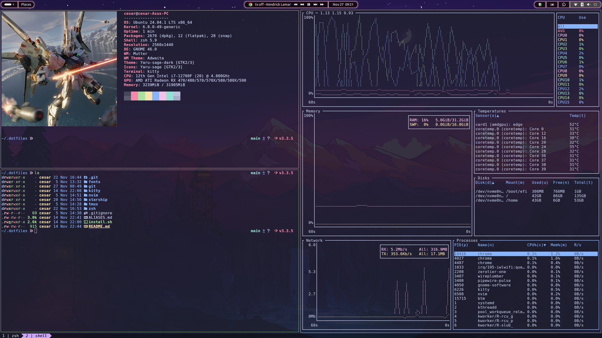
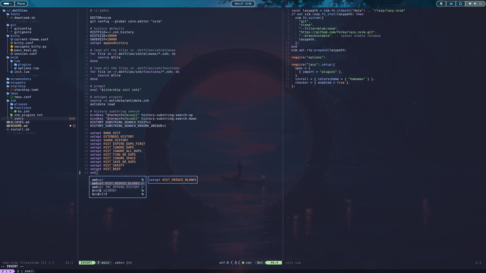
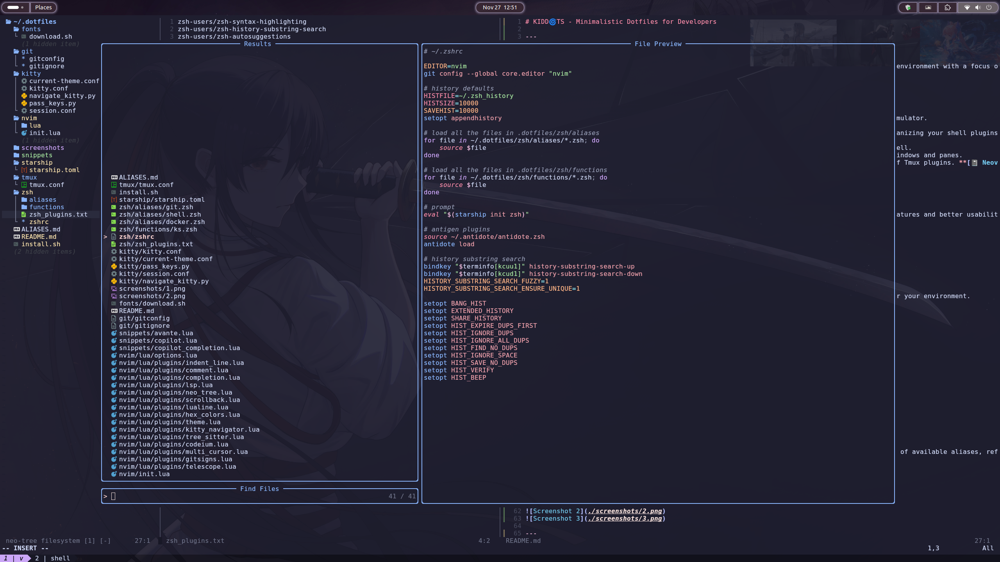

# KIDD🌀TS - Minimalistic Dotfiles for Developers

## 🌟 Overview

KIDD🌀TS is a carefully crafted collection of dotfiles designed to create a productive, efficient, and streamlined development environment. With a focus on simplicity, performance, and usability, this setup empowers developers to work smarter, not harder.

## 🛠 Tools Ecosystem

### Terminal & Shell
- **[🐱 Kitty](https://sw.kovidgoyal.net/kitty/)**: A lightning-fast, GPU-accelerated terminal emulator
- **[⬛ Zsh](https://www.zsh.org/)**: A powerful shell with extensive customization capabilities
- **[💉 Antidote](https://getantidote.github.io/)**: Efficient Zsh plugin management

### Productivity Boosters
- **[🚀 Starship](https://starship.rs/)**: A minimal and blazing-fast cross-shell prompt
- **[🪟 Tmux](https://tmux.github.io/)**: Terminal multiplexer for managing multiple sessions
- **[🔌 TPM](https://github.com/tmux-plugins/tpm)**: Streamlined Tmux plugin management

### Development
- **[📓 Neovim](https://neovim.io/)**: Modern, extensible text editor for power users

## 🔧 System Requirements

### Minimum Dependencies
- Neovim v0.10+
- Kitty Terminal v0.32+
- [Eza](https://github.com/eza-community/eza) Modern `ls` replacement
- zsh
- luarocks
- git
- curl
- unzip
- ripgrep

here is what I use for my system:
https://github.com/cesargomez89/dotflakes/blob/main/nixos/configuration.nix#L116

## 🚀 Quick Start

### Installation
Install KIDD🌀TS with a single command:

```bash
curl -s https://raw.githubusercontent.com/cesargomez89/kiddots/main/install.sh | bash
```

## 🌈 Key Features

### Kitty Navigation Shortcuts

#### Pane & Window Movement
- `Ctrl + h/j/k/l`: Seamless navigation between panes and windows
- `Ctrl + Shift + Left/Right Arrow`: Quick tab switching
- `Ctrl + TAB`: Cycle through tabs
- `Ctrl + Shift + t`: Instantly open new tabs
- `Ctrl + Shift + l`: Toggle layout between standard and zoomed

### Shell Productivity
- Comprehensive set of shell aliases
- Detailed alias documentation available in [ALIASES.md](ALIASES.md)

### Zsh Shortcuts

#### Shell
| Shortcut | Command | Description |
|----------|---------|-------------|
| `c` | `clear` | Clear terminal |
| `v` | `nvim` | Open Neovim |
| `ip` | `curl -s ifconfig.me` | Get public IP |
| `localip` | `hostname -I \| awk '{print $1}'` | Get local IP |
| `tml` | `tmux list-sessions` | List tmux sessions |
| `tmk` | `tmux kill-session -t $1` | Kill tmux session |

#### Eza (ls replacements)
| Shortcut | Command | Description |
|----------|---------|-------------|
| `ls` | `eza --icons=auto --hyperlink --group-directories-first` | List files with icons |
| `la` | `eza -la` | List all files including hidden |

#### Kitty Sessions
| Shortcut | Command | Description |
|----------|---------|-------------|
| `ks` | `ksession basic` | Switch to basic session |
| `ksd` | `ksession docker` | Switch to docker session |
| `ksg` | `ksession git` | Switch to git session |

#### Git
| Shortcut | Command | Description |
|----------|---------|-------------|
| `g` | `git` | Git command |
| `gb` | `git branch` | List branches |
| `gbc` | `git checkout -b` | Create and checkout new branch |
| `gbd` | `git branch --delete` | Delete branch |
| `gc` | `git commit --verbose` | Commit with verbose diff |
| `gca` | `git commit --verbose --all` | Commit all files |
| `gco` | `git checkout` | Checkout branch/file |
| `gf` | `git fetch` | Fetch from remote |
| `gl` | `git log` | View commit log |
| `glg` | `git log --graph` | View graph log |
| `gm` | `git merge` | Merge branch |
| `gp` | `git push` | Push to remote |
| `gpf` | `git push --force-with-lease` | Force push safely |
| `gr` | `git rebase` | Rebase onto branch |
| `gs` | `git stash` | Stash changes |
| `gsp` | `git stash pop` | Pop stashed changes |
| `gws` | `git status --short` | Quick status |

#### Docker
| Shortcut | Command | Description |
|----------|---------|-------------|
| `dk` | `docker` | Docker command |
| `dkps` | `docker ps` | List running containers |
| `dkc` | `docker compose` | Docker compose |
| `dkcu` | `docker compose up` | Start services |
| `dkcU` | `docker compose up -d` | Start services detached |
| `dkcd` | `docker compose down` | Stop services |

### Neovim Configuration

#### Core Setup
- **Package Manager**: Lazy.nvim
- **Plugins**: Curated collection in [lua plugins](./nvim/lua/plugins/)
- **Customizations**: Detailed in [options.lua](/nvim/lua/options.lua)
- **AI Assistance**:
  - [Codeium](https://codeium.com/)
  - [Supermaven](https://supermaven.com/)
  - [Avante.nvim](https://github.com/yetone/avante.nvim)

#### Keyboard Shortcuts

- **Leader Key**: Space (`<leader>`)

#### File Navigation
| Shortcut | Action | Description |
|----------|--------|-------------|
| `<C-p>` | Telescope | Find files in project |
| `<leader>ff` | Telescope find_files | Fuzzy find files |
| `<leader>fg` | Telescope live_grep | Live grep in project |
| `<leader>fb` | Telescope buffers | Switch between buffers |
| `<leader>fh` | Telescope help_tags | Search help tags |
| `<leader>fe` | Neotree toggle | Toggle file explorer |

#### LSP (Language Server Protocol)
| Shortcut | Action | Description |
|----------|--------|-------------|
| `K` | vim.lsp.buf.hover | Show hover information |
| `<leader>gd` | vim.lsp.buf.definition | Go to definition |
| `<leader>gr` | vim.lsp.buf.references | Show references |
| `<leader>ca` | vim.lsp.buf.code_action | Show code actions |
| `<leader>rn` | vim.lsp.buf.rename | Rename symbol |

#### AI & Code Completion
| Shortcut | Action | Description |
|----------|--------|-------------|
| `<Tab>` | nvim-cmp | Next completion item |
| `<S-Tab>` | nvim-cmp | Previous completion item |
| `<Enter>` | nvim-cmp | Accept completion |
| `<C-a>` | Opencode | Ask AI for selection |
| `<C-x>` | Opencode | Execute action |
| `<C-.>` | Opencode | Toggle Opencode panel |
| `go` | Opencode | Add range to Opencode |
| `<leader>aa` | Avante | Open AI chat |

#### Text Editing
| Shortcut | Action | Description |
|----------|--------|-------------|
| `gq` | Conform | Format code |
| `+` | vim.nvim.inc | Increment number |
| `-` | vim.nvim.decre | Decrement number |

#### Search & Replace
| Shortcut | Action | Description |
|----------|--------|-------------|
| `<leader>S` | Spectre | Search & replace in project

#### AI Chat

**[💬 Avante.nvim](https://github.com/yourgithublink/avante.nvim)**: Seamless AI chat integration directly within Neovim

- sources:
  - [gemini](https://ai.google.dev/) (default/free) - requires an API key (GEMINI_API_KEY)

shortcuts:
- <leader> + aa: open AI chat
- <Control> + s Submit prompt 

#### AI Autocompletion
- **[🤖 Codeium](https://codeium.com/)**: Intelligent code suggestions powered by AI (Virtual Text + cmp)
- **[⚡️ Supermaven](https://supermaven.com/)**: Advanced AI-driven code completion (cmp)

**Integration with nvim-cmp**

- sources:
  - supermaven
  - codeium
  - luasnip
  - lsp
  - buffer
  - path

- shortcuts:
  - <Tab> next item
  - <S-Tab> previous item
  - <Enter> accept suggestion

## 📸 Visual Preview

### Development Environment Screenshots




## 🤝 Contributing

We welcome contributions! To get involved:
1. Fork the repository
2. Create your feature branch
3. Commit your changes
4. Push to the branch
5. Submit a pull request

## 🔗 Project Links
- **Source Code**: [GitHub Repository](https://github.com/cesargomez89/kiddots)
- **Issues**: [GitHub Issues](https://github.com/cesargomez89/kiddots/issues)

**Made with ❤️ by Developers, for Developers**
